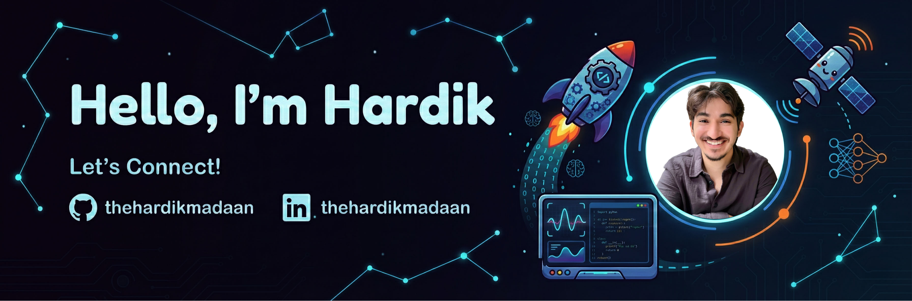

  

 

### Hi there! 👋 I'm Hardik

I am a **Master's student in Aerospace Engineering** at **Technische Universität Darmstadt**, Germany. My passion lies at the intersection of aviation and software, specifically focusing on **Machine Learning**, **Cockpit UI/UX**, and **Human-Machine Interaction (HMI)**.

I bridge the gap between mechanical systems and digital interfaces, creating intuitive solutions for complex aerospace problems.

---

### 🔭 Currently Working On

* **Predictive Maintenance with ML (Based on NASA C-MAPSS)**
  * Developing a Machine Learning model to predict the **Remaining Useful Life (RUL)** of gas turbine engines.
  * Utilizing the **NASA C-MAPSS dataset** for training and validation.
  * Implementing deep learning architectures using **TensorFlow** and **Keras Tuner** for hyperparameter optimization to achieve high predictive accuracy.

---

### 🚀 Completed Projects

* **Flight Simulator Interface (UDP & PySide6)**
  * Designed and implemented a complete UI/UX interface for single-pilot simulator displays.
  * Established real-time connectivity with the simulator (X-Plane) using **UDP protocols** for seamless data transmission.
  * Focused on pilot-centric design patterns to reduce cognitive load during flight operations.

* **Aviation Safety Analysis (Boeing Project)**
  * Conducted Runway Incursion Analysis and Safety Evaluation aligned with **RTCA DO-323** standards.
  * Performed sensitivity analysis on historical data to improve collision avoidance logic in cockpit environments.

---

### 🛠️ Technical Skills

#### 🧠 Machine Learning & Data Science
     

#### ✈️ Aviation UI/UX & Simulation
    

#### ⚙️ Engineering & Tools
   

---

### 📫 Connect with Me

* 📍 **Location:** Darmstadt, Germany
* 🗣️ **Languages:** English (Fluent), German (B1/B2)
* 💼 **LinkedIn:** [thehardikmadaan](https://www.linkedin.com/in/thehardikmadaan/)
* 📧 **Email:** [hardik.madaan5@gmail.com](mailto:hardik.madaan5@gmail.com)

I am currently open to **Master's Thesis opportunities**, **projects**, and **student jobs** in the field of Aerospace Engineering, ML, HMI, and Data Science.
